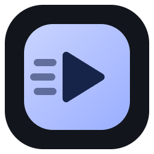
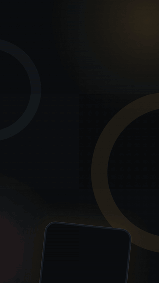
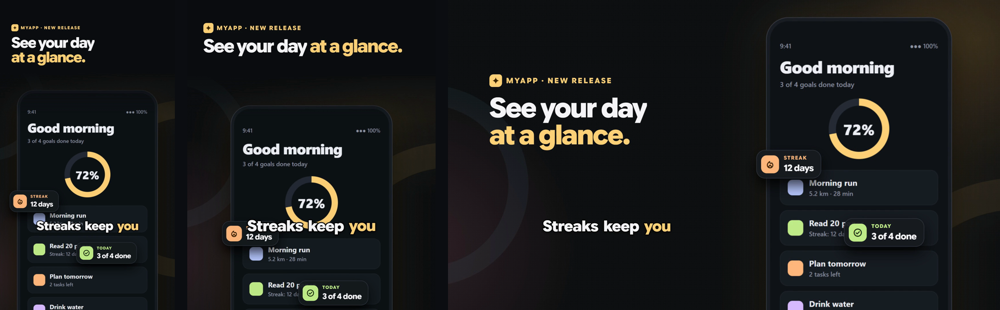
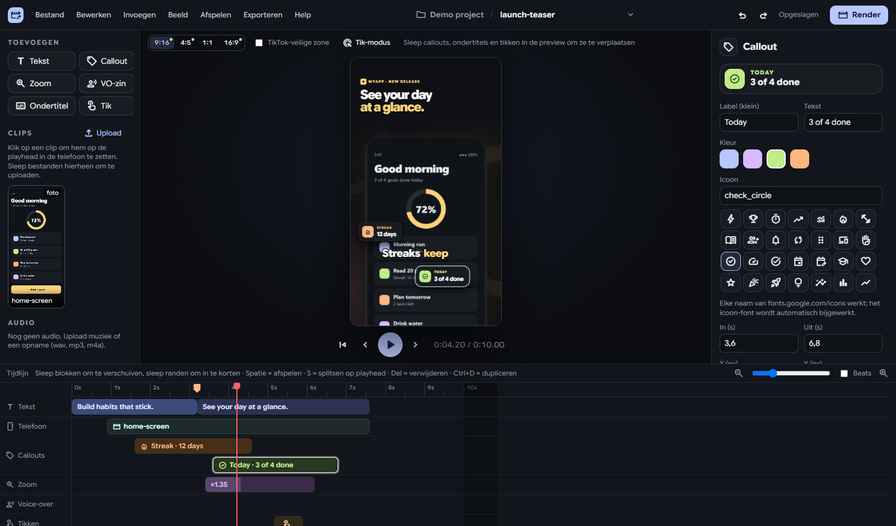

<div align="center">



# Motion Studio

**Make polished promo videos of your app in minutes: device mockups, callouts, zooms, captions, voice-over and
music, rendered to MP4 for TikTok, Reels, Shorts, LinkedIn and YouTube.**

[](LICENSE)
[](https://github.com/tinygusie2/motion-studio/actions/workflows/ci.yml)
[](CONTRIBUTING.md)
[](https://github.com/tinygusie2/motion-studio/issues?q=is%3Aopen+label%3A%22good+first+issue%22)




</div>

---

> ### 🙌 This project wants your help
> Motion Studio is young, open source and **looking for contributors**. You don't need to be an expert: fixing a
> typo, translating the interface, testing on macOS, designing a new device frame or writing a test all count.
> Read **[CONTRIBUTING.md](CONTRIBUTING.md)**, pick an [open issue](https://github.com/tinygusie2/motion-studio/issues)
> (or the [ideas below](#-where-you-can-help)), and open a pull request. Every contribution gets a review and a thank-you.

---

## What it does

You drop in screen recordings or screenshots of your app. Motion Studio puts them in a device (phone, two phones,
tablet, browser window, full screen, or no device at all with the text centered) and animates everything around them:

- **Starters** for the usual promo videos (app launch, how-to in 3 steps, before/after, website tour, quick tip),
  filled with your own clips so you start from a finished video instead of an empty timeline
- **Headlines** that rise in word by word, with an accent color (`*like this*`)
- **Callouts** with icons, counters and a live dot, dragged into place on the preview
- **Transitions** between clips (crossfade, slide, whip, zoom, blur, flash, spin) and **keyframes** to move, scale,
  rotate and fade a clip over time
- **Talking-head edits**: keep a clip's sound, **cut the silences** out of it in one click, and **cut words**
  out of the video by clicking them in the captions
- **Demo recording**: operate your web app or Android phone inside Motion Studio and record it, with every tap, swipe
  and long press logged (also the ones you make on the phone itself) and turned into animated touches, and demo data (a made-up persona) typed into the forms
- **Zooms** onto a point you click, and **taps / clicks** that show where to look
- **Captions** in four styles (pop, karaoke, block, classic), made from the voice-over, from any audio track with
  **speech recognition** (Whisper, on your own computer, every word at its exact moment) or imported from `.srt`/`.vtt`
- **Voice-over** from text (Kokoro / Piper TTS), plus a **music bed** that fades, ducks under the voice and
  carves an EQ pocket for it, so speech stays clear while the music stays full
- **Beat detection**: snap cuts and callouts to the music
- **Brands**: logo, font, colors and end card, set once and used by every video
- **Four formats from one edit**: 9:16, 4:5, 1:1 and 16:9, each laid out on its own, with per-format positions
  for callouts and captions when a format needs them
- **Batch render** of many videos in one go, with an `.srt` next to every MP4

<p align="center"></p>

And it's a real editor: a timeline with snapping, trimming and splitting (S), undo/redo, copy and paste between
videos, markers, a crop window, a fit check for screenshots, and a menu bar with keyboard shortcuts for everything.

<p align="center"></p>

Videos are rendered by [HyperFrames](https://hyperframes.heygen.com), which renders HTML + GSAP compositions to
video. The preview in the editor *is* the composition that gets rendered, so what you see is what you get.

> The interface speaks **English** and **Dutch**. It follows your system language; change it under
> *File → Settings → Interface language*. Want it in your language? That's a great first contribution,
> see [adding a language](CONTRIBUTING.md#adding-a-language).

## Getting started

You need [Node.js](https://nodejs.org) 22+ and [ffmpeg](https://ffmpeg.org) on your `PATH`. Voice-over is
optional and needs a Python with [Kokoro](https://github.com/hexgrad/kokoro) (English, via `hyperframes tts`)
and/or [Piper](https://github.com/rhasspy/piper) (Dutch voices); set the paths under *File → Settings*.

```bash
git clone https://github.com/tinygusie2/motion-studio.git
cd motion-studio
npm install
npm start
```

On first start, create a project folder (*New project…*), drop a screen recording on the window, click
*New video* and pick a starter.

| Command | What it does |
| --- | --- |
| `npm start` | Run the app from source (Electron) |
| `npm test` / `npm run check` | Run the tests / syntax-check every script (both run in CI on every pull request) |
| `npm run test:ui` | Editor tests in your installed Chrome or Edge (dragging, trimming, splitting, undo, saving) |
| `npm run serve` | Run the editor in your normal browser at http://localhost:3400, which is handy for development |
| `npm run pack` | Build `dist/Motion Studio-win32-x64/Motion Studio.exe` |
| `npm run sign` | Sign that `.exe` (see [signing](#signing-on-windows)) |
| `npm run dist` | `pack` + `sign` |

### Handy shortcuts

<kbd>Space</kbd> play · <kbd>S</kbd> split · <kbd>T</kbd> tap mode · <kbd>M</kbd> marker ·
<kbd>[</kbd> <kbd>]</kbd> previous/next marker or beat · <kbd>Ctrl</kbd>+<kbd>C</kbd>/<kbd>V</kbd> copy/paste
(also between videos) · <kbd>Ctrl</kbd>+<kbd>Shift</kbd>+<kbd>V</kbd> paste at the same time ·
<kbd>,</kbd> <kbd>.</kbd> nudge the selection a frame · <kbd>Alt</kbd> while dragging: no snapping ·
<kbd>Shift</kbd>+<kbd>Del</kbd> ripple delete a clip · <kbd>\</kbd> fit the timeline ·
<kbd>Ctrl</kbd>+<kbd>R</kbd> render · <kbd>Alt</kbd> menu bar. The full list is under *Help → Keyboard shortcuts*.

## 🤝 Where you can help

Everything below is open for grabs. Comment on (or open) an issue so others know you're on it.

**Good first contributions**
- 🌍 **Translate the UI** into your language: one table in `ui/i18n.js` (see [adding a language](CONTRIBUTING.md#adding-a-language))
- 📱 **New device frames**: an Android phone, a laptop, a smartwatch (see [adding a layout](docs/ARCHITECTURE.md#adding-a-layout))
- 🎨 **Caption and callout styles**: new looks are mostly CSS and a few GSAP lines
- 🧩 **New starters**: a promo idea you keep making? It is one function in `src/starters.mjs` (see [starters](docs/ARCHITECTURE.md#starters))
- 📝 **Docs**: tutorials, a "your first video" guide, GIFs of features

**Bigger features**
- 🍎 **macOS and Linux builds**: the code is cross-platform, but packaging and testing aren't there yet
- 🎙️ **Whisper on macOS and Linux**: Windows installs whisper.cpp by itself, elsewhere it has to be installed by hand
- 🧪 **More tests**: the modules (`npm test`) and the timeline basics (`npm run test:ui`) are covered; rendering and
  most of the inspector aren't yet
- 🎞️ **Keyframes on more than clips**: callouts, headlines and the device
- 🖼️ **Templates**: save a video as a reusable starting point for the next one

Found a bug? [Open an issue](https://github.com/tinygusie2/motion-studio/issues/new/choose). Have an idea?
Same place. Questions are welcome too.

## Signing on Windows

`npm run sign` signs the app with `signtool` (Windows SDK). It uses the first certificate it finds:

1. `MS_SIGN_PFX` (+ `MS_SIGN_PFX_PASSWORD`): a `.pfx` from a certificate authority
2. `MS_SIGN_THUMBPRINT`: a certificate in your Windows certificate store
3. a self-signed "Motion Studio" certificate (`npm run sign:cert` creates one)

A self-signed signature proves the file wasn't changed, but Windows SmartScreen still says *unknown publisher*
on other PCs. Only a certificate from a trusted authority (or Azure Trusted Signing) removes that.

## How it's built

Electron + a small Node HTTP server + vanilla JS (no framework, no build step). The video is an HTML page with a
GSAP timeline, rendered by HyperFrames. Read **[docs/ARCHITECTURE.md](docs/ARCHITECTURE.md)** for a tour of the
code and the project/spec format.

## License

[MIT](LICENSE). Use it, change it, ship it. Contributions are accepted under the same license.

The bundled fonts keep their own licenses: Google Sans Flex (SIL Open Font License) and Material Symbols
(Apache 2.0), both from [Google Fonts](https://fonts.google.com). GSAP is loaded from its CDN under its own
(free) license.

---

<div align="center">

**Made something with Motion Studio? Share it in [Discussions](https://github.com/tinygusie2/motion-studio/discussions). And if you like it, a ⭐ helps others find it.**

</div>
